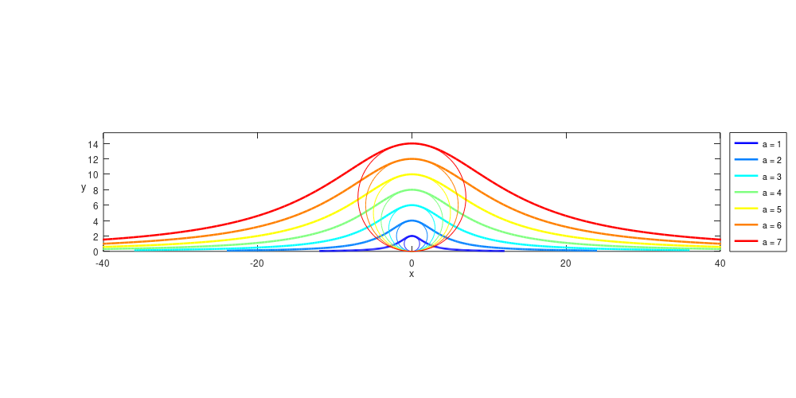

# Agnesi Curves Generator
This set of MATLAB/Octave scripts generates Agnesi curves and visualizes them in a colorful plot.

## Requirements using Octave
- Make sure you have Octave installed on your system.
- Open Octave in your terminal or command prompt.
- Copy and paste the following code to load the necessary packages and generate Agnesi curves:

```bash
pkg install "https://downloads.sourceforge.net/project/octave/Octave%20Forge%20Packages/Individual%20Package%20Releases/matgeom-1.2.3.tar.gz"

pkg load matgeom

```

# Usage

Run the script, and the Agnesi curves will be generated and saved as "Agnesi_curves.png".



Feel free to modify the parameters and experiment with different inputs to create unique Agnesi curves.